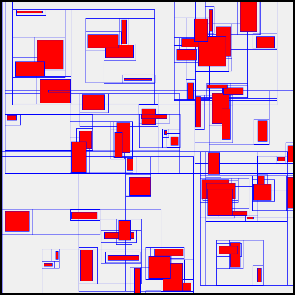
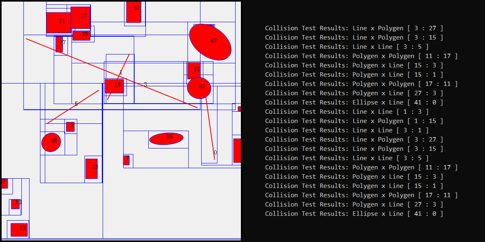

# LSP-Engine
##### *Less than Shit Physics Engine*

### TODO List

***

* **Base**

1. - [x] Common Utils
	- * [x] DEBUG Macros
	- * [x] Universal Functions
	- * [x] Math Constants
2. - [x] Vector
	- * [x] vec2
	- * [x] vec3
3. - [x] Matrix
	- * [x] mat2x2
	- * [x] mat3x3

***

* **Shape**

1. - [x] Line
2. - [x] Circle
3. - [x] Convex Polygen
4. - [x] Ellipse
5. - [ ] Bézier Curve
	- * [ ] Quadratic Bézier Curve
	- * [ ] Cubic Bézier Curve

***

* **Collision Test**

> 该部分分为 `BroadPhase` 和 `NarrowPhase`
> 
>> `BroadPhase` 采用 `Dynamic AABB Tree` 进行对象索引，使用 `Sweep and Prune` 算法进行粗检测
>> 
>> `NarrowPhase` 采用 `GJK` `EPA` `MPR` 算法进行相撞间的碰撞测试

1. - [ ] BroadPhase
	- * [x] Dynamic AABB Tree
	- * [ ] Sweep and Prune
2. - [ ] NarrowPhase
	- * [ ] Support Shapes
		- * [ ] Line Segment
		- * [ ] Ray
		- * [ ] Straight Line 
		- * [x] Circle
		- * [x] Convex Polygen
		- * [x] Ellipse
		- * [ ] Quadratic Bézier Curve
		- * [ ] Cubic Bézier Curve
	- * [x] GJK
	- * [x] EPA
	- * [ ] MPR

***

### Demo Snapshot

> **Dynamic AABB Tree**

> **Collision Detection**

### Reference
* **GitHub**
	* [`Box2D`](https://github.com/erincatto/box2d)
	* [`Apollonia`](https://github.com/wgtdkp/apollonia)
	* [`Bullet Physics SDK`](https://github.com/bulletphysics/bullet3)
	* [`物理引擎学习`](https://github.com/youlanhai/learn-physics)
	* [`gjk.c – Gilbert-Johnson-Keerthi In Plain C`](https://github.com/kroitor/gjk.c)
	* [`Box2D-Lite`](https://github.com/erincatto/box2d-lite)
	* [`C++ implementation of GJK and EPA algorithms for 2D collision detection`](https://github.com/Discordia/gjk-epa)
* **PDF**
	* [A Fast and Robust GJK Implementation for Collision Detection of Convex Objects](http://www.dtecta.com/papers/jgt98convex.pdf)
	* [How Do Physics Engines Work?](https://github.com/erincatto/box2d-lite/blob/master/docs/HowDoPhysicsEnginesWork.pdf)
	* [Fast and Simple Physics using Sequential Impulses](https://github.com/erincatto/box2d-lite/blob/master/docs/GDC2006_Catto_Erin_PhysicsTutorial.pdf)
	* [Dynamic Bounding Volume Hierarchies](https://box2d.org/files/ErinCatto_DynamicBVH_GDC2019.pdf)
	* [An Efficient Parallel Algorithm for Polygons Overlay Analysis](https://mdpi-res.com/d_attachment/applsci/applsci-09-04857/article_deploy/applsci-09-04857.pdf)
	* [Proximity Queries and Penetration Depth Computation on 3D Game Objects](http://www.dtecta.com/papers/gdc2001depth.pdf)
* **知乎**
	* [游戏物理引擎(二) 碰撞检测之Broad-Phase](https://zhuanlan.zhihu.com/p/113415779)
	* [游戏物理引擎(三) 碰撞检测之Narrow-Phase](https://zhuanlan.zhihu.com/p/127844705)
	* [现代游戏物理引擎入门(三)——碰撞检测(上)](https://zhuanlan.zhihu.com/p/396719279)
	* [2D凸多边形碰撞检测算法（二） - GJK（上）](https://zhuanlan.zhihu.com/p/177006015)
	* [2D凸多边形碰撞检测算法（二） - GJK（下）](https://zhuanlan.zhihu.com/p/178583914)
	* [2D凸多边形碰撞检测算法（二） - GJK 椭圆、曲线与最近点计算](https://zhuanlan.zhihu.com/p/355267104)
	* [2D凸多边形碰撞检测算法（二） - EPA](https://zhuanlan.zhihu.com/p/178841676)
	* [2D凸多边形碰撞检测算法（三）- MPR](https://zhuanlan.zhihu.com/p/370089434)
	* [学习｜判断一个点是否在三角形内](https://zhuanlan.zhihu.com/p/106253152)
	* [连续碰撞检测 - CCD](https://zhuanlan.zhihu.com/p/380532960)
* **CSDN**
	* [物理引擎学习03-GJK碰撞检测算法基础](https://blog.csdn.net/you_lan_hai/article/details/108293780)
	* [GJK之判断是否相交](https://blog.csdn.net/u011373710/article/details/39851783)
	* [判断是两个形状是否相交(一)-SAT分离轴理论](https://blog.csdn.net/u011373710/article/details/54773171)
	* [物理引擎学习05-GJK和EPA计算穿透向量](https://blog.csdn.net/you_lan_hai/article/details/108300750)
	* [详谈判断点在多边形内的七种方法（最全面） hdu1756 hrbust1429 为例](https://blog.csdn.net/WilliamSun0122/article/details/77994526)
* **Others**
	* [Gilbert-Johnson-Keerthi Distance Algorithm](https://cse442-17f.github.io/Gilbert-Johnson-Keerthi-Distance-Algorithm/)
	* [GJK (Gilbert–Johnson–Keerthi)](https://dyn4j.org/2010/04/gjk-gilbert-johnson-keerthi/)
	* [Box2D 2.4.1 A 2D physics engine for games](https://box2d.org/documentation/)
	* [Video Game Physics Tutorial - Part II: Collision Detection for Solid Objects](https://www.toptal.com/game/video-game-physics-part-ii-collision-detection-for-solid-objects)